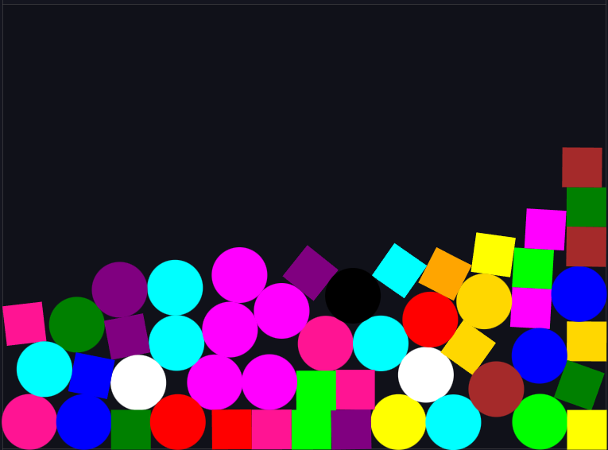

# Shape Pit - Matter.js

A simple interactive simulation created using the Matter.js physics engine. Shapes of various colors and types are randomly generated within a confined space, and users can interact with them using the mouse.

## Features

- Randomly generated shapes (rectangles and circles) with various colors.
- Interactive environment using Matter.js physics engine.
- Mouse control for interacting with the shapes.

## Installation

1. Clone the repository:
    ```sh
    git clone https://github.com/your-username/shape-pit-matter-js.git
    ```

2. Navigate to the project directory:
    ```sh
    cd shape-pit-matter-js
    ```

3. Open `index.html` in your web browser.

## Usage

- Simply open the `index.html` file in a web browser to start the simulation.
- Use the mouse to interact with the shapes.

## Technologies Used

- HTML
- JavaScript
- [Matter.js](https://brm.io/matter-js/)

## Screenshots


## License

This project is licensed under the MIT License - see the [LICENSE](LICENSE) file for details.

## Author

- **Your Name** - [your-username](https://github.com/your-username)

